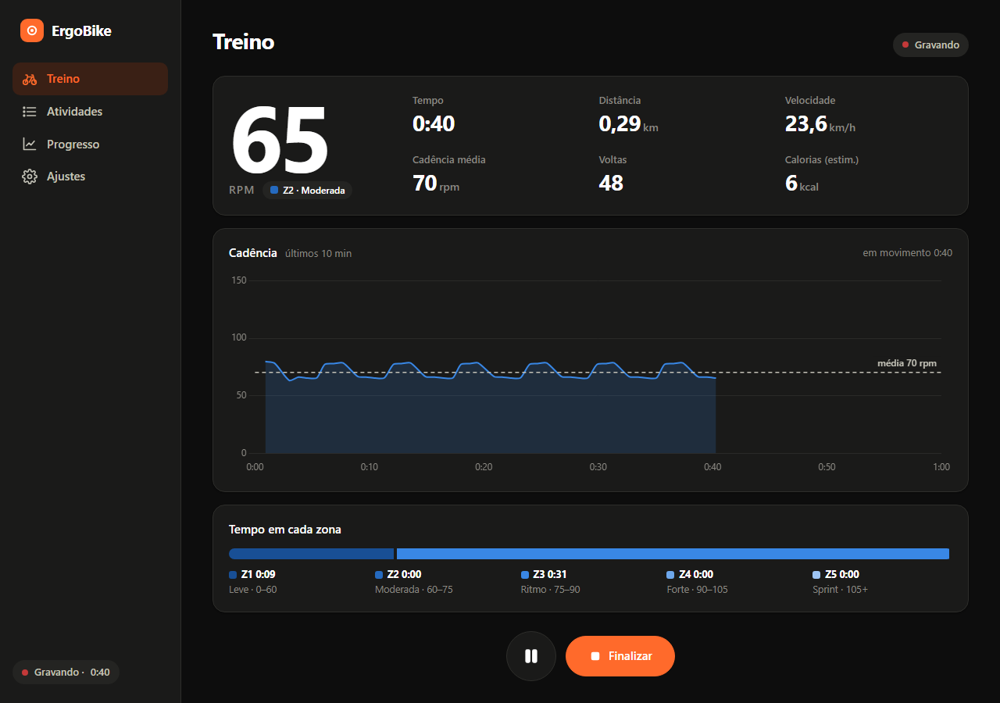
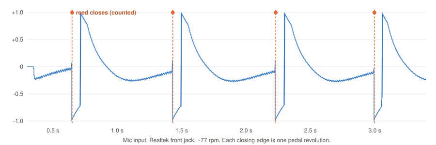
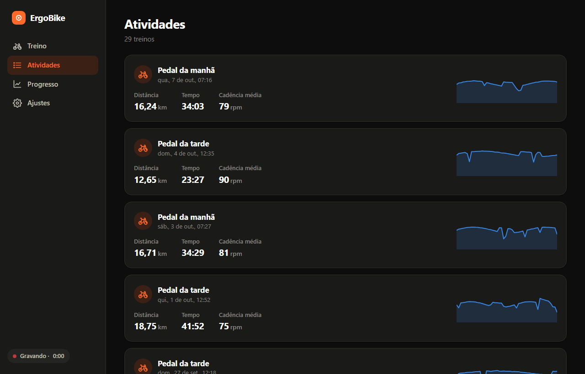
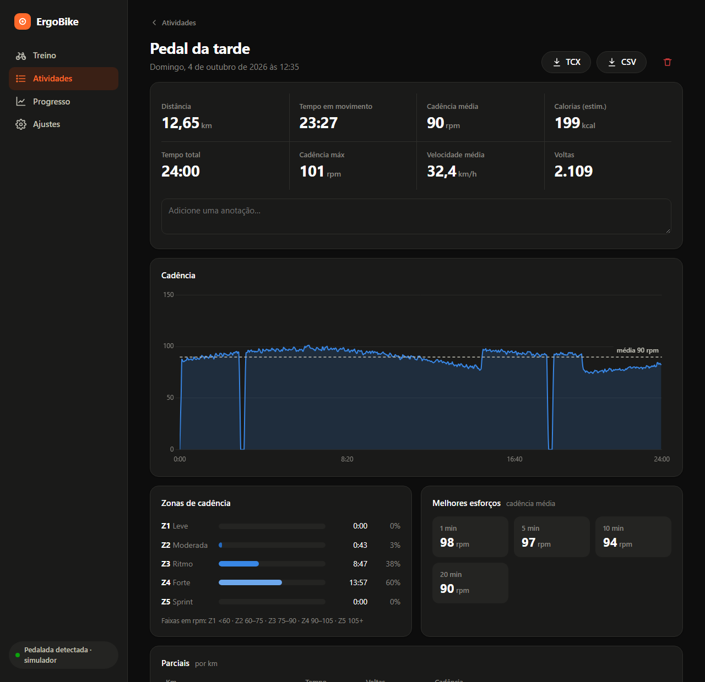
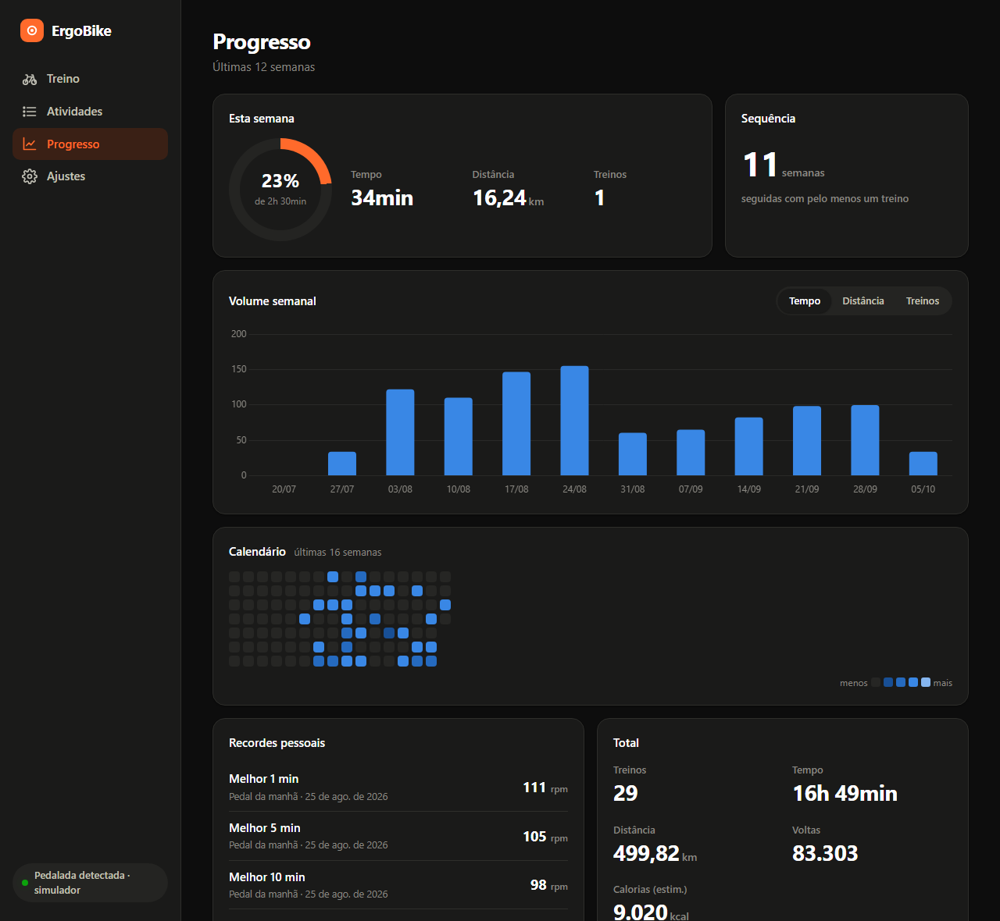
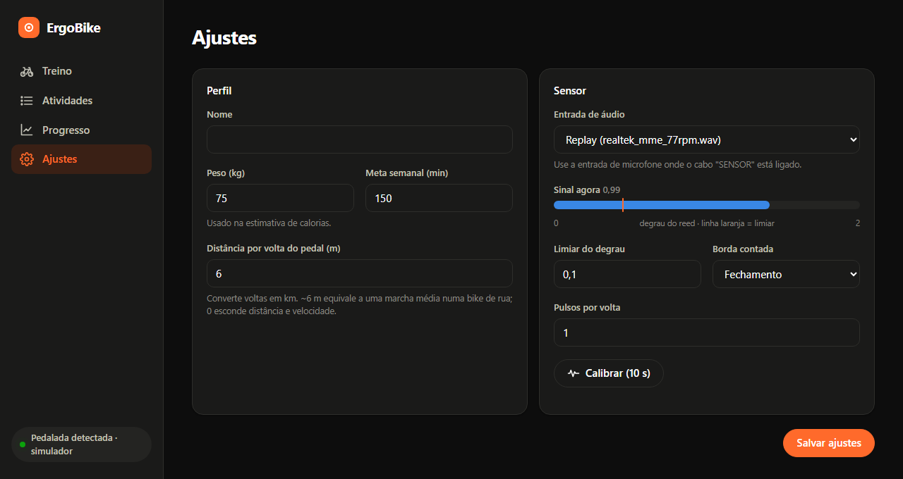
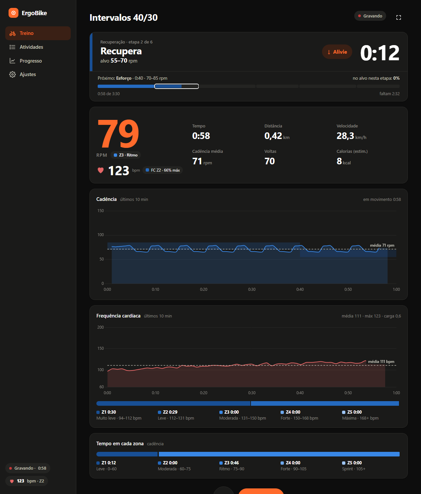

# ErgoBike Sensor
<br clear="left">

I have an old exercise bike with a little cable hanging out of it labelled **SENSOR**, ending in a
3.5 mm mono jack. There's no display that does anything useful with it and no Bluetooth, so I
plugged it into the microphone input of my PC to see what would happen.

It turns out that's enough to get a decent cadence reading. This repo is the result: a small
Windows app that listens to the mic input, counts pedal revolutions and keeps a history of rides,
plus an ESP32 sketch for when I want to drop the PC and use Zwift or Kinomap instead.



> The UI is in Brazilian Portuguese, since that's who uses it at home. The code and docs are in English.

## How it works

The sensor is a reed switch: a magnet on the crank closes a contact once per revolution. It has no
power and sends no data, it just opens and closes a circuit.

A PC mic input supplies a small bias voltage ("plug-in power") for electret microphones. When the
reed closes, it shorts that bias. The input is AC-coupled, so what reaches the sound card is a
sharp step that decays over ~200 ms, followed by a step the other way when the reed opens:



Between pulses the baseline drifts by about ±0.25, so a simple amplitude threshold double counts.
Instead, the detector compares the average of the last 1 ms of audio with the 1 ms before it. A real
step goes through almost untouched (0.5 to 1.7 on my machine) while slow drift, 60 Hz hum and short
interference spikes from wiggling the cable average out to ~0.02. Only the closing edge is
counted, so every revolution gives exactly one event without needing a debounce to merge the two.

Timestamps come from counting samples. PortAudio's `inputBufferAdcTime` is zero (or alternates
between two values) on MME, so it can't be trusted for timing.

A few things I learned the hard way are covered by tests with real recordings in `tests/data`:
idle noise, slow pedalling, a burst of electrical interference, and a clean 77 rpm segment.

## Features

- Live cadence with zones, ride time, moving time, revolutions, estimated distance, speed and calories
- Structured workouts (HIIT 30/30, Tabata, sprints, pyramid, steady cadence, endurance) and a builder
  for your own intervals. Each step has a target rpm range, a countdown, and beeps plus a spoken cue
  (Portuguese) when it changes
- Free rides with an optional time or distance goal
- Heart rate from a Wear OS watch through [Pulsoid](https://pulsoid.net), see below
- Pause / resume (space bar), focus mode (F), title and notes when you save
- Activity feed and a report per ride: cadence chart with the workout's target bands, time in
  target per step, time in zone, per-km splits, best 1 to 60 min efforts, and a heads-up when you
  set a new personal record
- Export to **TCX** (upload to Strava or Garmin Connect as an indoor ride) or CSV
- Weekly goal, streak, 12-week volume, 16-week calendar, all-time totals
- Settings screen with a live signal meter and a 10 second auto calibration
- Data lives in a local SQLite file, nothing leaves the machine

| Activities | Ride report |
|---|---|
|  |  |

| Progress | Settings |
|---|---|
|  |  |



Distance and speed are estimates: you set how many metres one pedal revolution is worth (6 m is a
reasonable middle gear). Without heart rate, calories use a MET value picked from the average
cadence, times body weight and moving time. There's no resistance or power measurement, so treat
it as a ballpark.

## Heart rate (Pulsoid)

The bike only knows cadence. To get some idea of how hard a ride actually was, the app can pull
heart rate from a Wear OS watch through Pulsoid: the watch app sends readings to the Pulsoid phone
app, Pulsoid streams them over a WebSocket, and ErgoBike listens.

1. Install Pulsoid on your Android phone and log in with a pulsoid.net account.
2. Open Pulsoid on the watch and start measuring.
3. Create a token at [pulsoid.net/ui/keys](https://pulsoid.net/ui/keys) with the
   `data:heart_rate:read` scope. Manual tokens are a feature of Pulsoid's BRO plan (there's a trial).
4. Paste it in **Ajustes > Frequência cardíaca**, press **Testar**, then save.

With heart rate the app adds:

- live bpm, % of max and heart-rate zone next to the cadence, plus its own chart
- calories from heart rate (Keytel et al., 2005) instead of the cadence-based MET guess
- training load per ride and per week (Banister TRIMP)
- cardiac drift: how much rpm-per-beat drops from the first to the second half of a steady ride
- heart rate per workout step, and how far it falls in the first minute of each rest
- heart rate in the TCX export, so it shows up on Strava

Pulsoid only exposes heart rate, so there's no HRV or RR data. Max heart rate defaults to
208 - 0.7 x age (Tanaka) unless you set your own.

No watch yet? `python -m ergobike --demo-hr` streams a simulated heart rate through a local fake
Pulsoid server, which is also what the tests use.

## Getting started

### Download

Grab `ErgoBike-x.y.z-windows-x64.zip` from the
[releases page](https://github.com/Tudolin/ergobike_sensor/releases), unzip it anywhere and run
`ErgoBike.exe`. It needs Windows 10/11 with the WebView2 runtime, which ships with Windows 11 and
any recent Edge install.

The app opens in its own window. Closing it shuts everything down. If you close it mid-ride it asks
whether to save or discard the ride first.

Rides are stored in `%LOCALAPPDATA%\ErgoBike\treinos.db` together with a log file.

### Hardware setup

1. Plug the bike's sensor jack into the **microphone** input (pink jack, front panel works fine).
   On laptops with a single 4-pole headset jack you'll probably need a TRRS splitter.
2. In Windows sound settings, open the microphone properties and turn off audio enhancements,
   noise suppression and automatic gain if your driver has them.
3. Open the app, go to **Ajustes** (settings), pick the input and press **Calibrar**. Pedal normally
   for 10 seconds and apply the suggested threshold.

The level meter on the settings screen should jump on every revolution and sit near zero otherwise.
If it doesn't move at all, the wrong input is selected or the jack isn't making contact.

### Run from source

```powershell
git clone https://github.com/Tudolin/ergobike_sensor.git
cd ergobike_sensor
python -m venv .venv
.venv\Scripts\pip install -e ".[dev]"

.venv\Scripts\python -m ergobike                  # desktop window
.venv\Scripts\python -m ergobike --browser        # same thing in your browser
.venv\Scripts\python -m ergobike --replay tests\data\realtek_mme_77rpm.wav   # no bike needed
.venv\Scripts\python -m ergobike --demo-hr            # simulated heart rate, no watch needed
.venv\Scripts\python -m pytest
```

`--replay` loops a WAV file in real time as if it were the microphone, which is how I work on the
UI without pedalling.

### Build the exe

```powershell
.venv\Scripts\pyinstaller packaging\ergobike.spec
```

The output lands in `dist\ErgoBike\`. Pushing a `v*` tag runs the same build on GitHub Actions and
attaches the zip to a release.

## Signal tools

When something looks off, the CLI is quicker than the app:

```powershell
python -m ergobike.cli list                          # input devices
python -m ergobike.cli calibrate --device 2          # noise vs step size, suggested threshold
python -m ergobike.cli live --device 2 --record ride.wav
python -m ergobike.cli replay ride.wav               # run the detector on a recording
python -m ergobike.cli replay ride.wav --calibrate
```

Recording a ride with `--record` and replaying it is the best way to check the count against
reality. Count 60 revolutions by hand and compare.

## ESP32 version

`firmware/esp32_csc/esp32_csc.ino` reads the same reed switch on an ESP32 and advertises it as a
standard Bluetooth **Cycling Speed and Cadence** sensor, so Zwift, Kinomap, Wahoo or any phone app
can use it directly.

- Wiring: one wire of the sensor jack to GND, the other to GPIO 4 (internal pull-up).
- Debounce is done by polling at ~1 kHz and requiring 10 ms of stable state.
- Built against arduino-esp32 2.x/3.x with the bundled BLE library.

I haven't flashed it on real hardware yet, so consider it untested.

## Project layout

```
ergobike/
  pulses.py     step detector and calibration
  cadence.py    pulse timestamps -> revolutions and rpm
  analysis.py   post-ride metrics, zones, splits, best efforts, TCX export
  audio.py      microphone stream, WAV replay and recording
  recorder.py   live ride state machine and stats
  workouts.py   built-in and custom interval plans, step tracking
  heartrate.py  Pulsoid WebSocket client and token check
  demo_hr.py    fake Pulsoid server for tests and --demo-hr
  storage.py    SQLite (rides, pulses, settings)
  server.py     FastAPI app + WebSocket for the UI
  desktop.py    WebView2 window around the server
  cli.py        signal diagnostics
  web/          front-end (plain JS, Chart.js)
firmware/       ESP32 BLE sketch
packaging/      PyInstaller spec, icon, launcher
tests/          unit + API tests, real recordings in tests/data
```

## Known limitations

- Windows only for the desktop build. The core and the web UI should run elsewhere with `--browser`,
  but I haven't tried.
- The signal depends on the mic bias and whatever processing the driver applies. Realtek onboard
  audio works well; some USB sound cards have no bias voltage at all.
- Cadence only. Speed, distance and calories are derived from it, not measured.

## License

MIT
